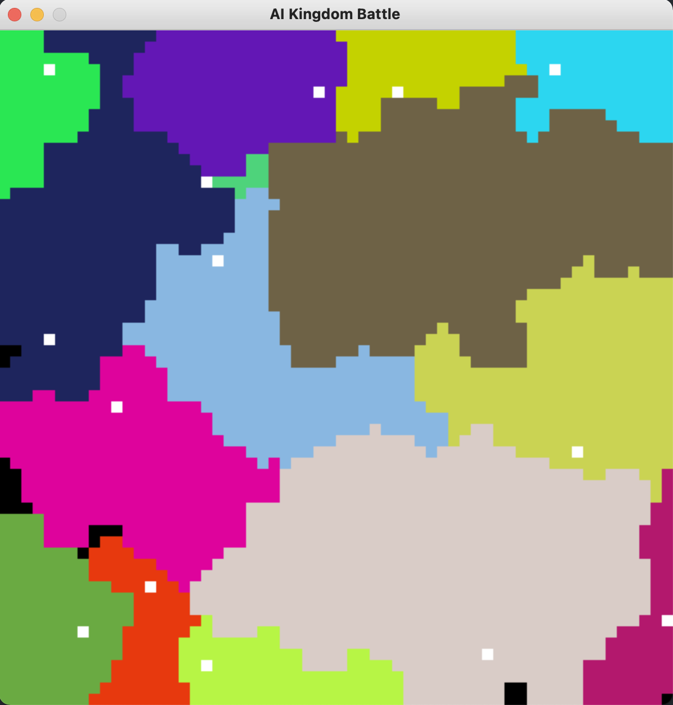

# AI Kingdom Battle
## Description
This project is meant to simulate different "kingdoms" capable of expanding and battling one another. Each kingdom is represented by its own color, and has a "capital," represented as a white square. A kingdom's strength is proportional to the amount of land it controls, and if any kingdom's capital is conquered by another kingdom, the opposing kingdom automatically gets the other kingdom's land.

## Running the Simulation
All that's necessary to run the simulation is to `git clone` this repository and then run `python3 main.py`

## Simulation Demo
Here's a picture of what the simulation will look like:

As seen above, many different kingdoms will conquer land(uncolonized land is black), and will attempt to grow and protect their capitals.
